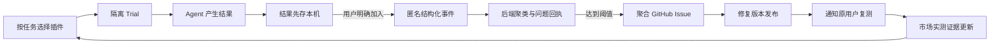

# Oh My DSH Plugin Lab

Plugin Lab 是 DeepSeek Harness 的插件试用与体验反馈闭环。它不要求用户“上传评价”，而是在一次真实试用之后帮助用户：

- 记录这次插件是否把事情做成；
- 查找相似问题并获得问题回执；
- 在修复版本发布时收到复测邀请；
- 用原任务复测，让市场证据随版本更新。

默认只保存在本机。只有用户点击“查找相似问题 / 加入并等待修复”，或明确运行 `/omdsh-join`，才会发送不含会话内容的结构化事件。

## 用户体验

1. 用户用 `/omdsh-start <plugin>#<version> [task-id]` 开始一次单插件 Trial。
2. Agent 完成后，最新回复旁出现“体验结果”。
3. 用户选择“做成了 / 做了一部分 / 没做成”。这一步只写入本机。
4. 结果卡提供与用户目标对应的动作：
   - 做成了：`贡献匿名实测`
   - 做了一部分：`查找相似问题`
   - 没做成：`加入并等待修复`
5. 分享后立即返回问题回执、相似报告数和当前状态。
6. Composer 左侧的“反馈进展”或 `/omdsh-inbox` 显示确认、Issue、修复版本与复测邀请。
7. `/omdsh-retest` 把复测结果关联回原回执；成功复测会把原问题标记为 `verified`。



## 安装开发版本

```sh
pnpm install
pnpm pack:release
dsh plugin --profile web add ./oh-my-dsh-plugin-lab-0.2.0.tgz
dsh --profile web
```

Plugin Lab 是一个标准 DSH Bundle：`package.json` 通过 `dsh.bundle.patch` 声明 `cordis.patch.yml`，同一个包还通过 `dsh.client` 提供 Web 结果卡和收件箱入口。

## 主要命令

| 命令 | 作用 |
|---|---|
| `/omdsh-start <module>[#version] [task-id]` | 开始一次单目标插件 Trial |
| `/omdsh-result <worked\|partial\|failed> [note]` | 只在本机记录结果 |
| `/omdsh-join <latest\|event-id> [--share-note]` | 明确加入匿名问题跟进 |
| `/omdsh-inbox [--peek]` | 拉取并查看新的处理进展 |
| `/omdsh-retest <receipt-id> <module>[#version] [task-id]` | 从回执启动修复复测 |
| `/omdsh-status` | 查看当前 Trial、待发送记录和未读进展 |
| `/omdsh-privacy` | 查看精确数据边界与本地路径 |
| `/omdsh-feedback ...` | 兼容旧版的一步式入口 |

## 数据边界

本地真源位于：

```text
$DSH_HOME/omdsh-plugin-lab/
  .install-id
  events.ndjson
  share-requests.ndjson
  receipts.ndjson
  receipt-seen.ndjson
```

目录权限为 `0700`，文件权限为 `0600`。插件不会收集或发送：

- Prompt 或 Assistant 回复正文；
- Tool 参数与结果；
- 工作目录或 DSH Session ID；
- 文件内容。

匿名事件只包含插件与版本、DSH/Node/系统版本、任务标签、Loader 状态、计数与时序、用户选择的结果。文字备注默认只留本地，只有 `--share-note` 才发送；服务端共享备注最长保留 30 天，并在后续写入时清理过期值。

## 启用中央反馈

Bundle 默认关闭上传。部署者必须配置接收地址：

```yaml
- id: omdsh-plugin-lab
  config:
    allowAnonymousShare: true
    ingestUrl: https://feedback.example.com/v1/experience-events
    authorizationEnv: OMDSH_PLUGIN_LAB_TOKEN
    profileLabel: plugin-lab
    requestTimeoutMs: 5000
    retryIntervalMs: 30000
```

即使部署允许分享，每一次 Trial 仍要由用户点击加入或运行 `/omdsh-join`。后来开启配置不会补传历史本地反馈。

## 后端

`server/` 是可自托管的 Node.js + PostgreSQL 接收器，提供：

- 事件幂等写入；
- 匿名安装 ID 的 HMAC 哈希；
- 按插件、版本、DSH 版本、任务和症状聚类；
- 独立安装数统计；
- 带 Follow Token 的问题回执；
- 修复发布和复测状态更新；
- 最近 30 天市场实测证据；
- 达到阈值后创建去内容化的 GitHub 聚合 Issue。

### 本机启动

```sh
docker compose up -d postgres
cp server/.env.example .env
set -a && source .env && set +a
pnpm server:build
pnpm server:migrate
pnpm server:start
```

生产环境至少需要：

```text
DATABASE_URL
PUBLIC_BASE_URL
PRIVACY_HASH_SECRET
FOLLOW_SECRET
ADMIN_TOKEN
```

可选的 GitHub 聚合：

```text
GITHUB_TOKEN=<具有目标仓库 Issues 写权限的 token>
GITHUB_REPOSITORY=omdsh-dev/omdsh-plugin-lab
GITHUB_REPORT_THRESHOLD=3
```

默认同一聚类达到 3 个独立匿名安装后才创建 Issue。GitHub 中不会出现“一条反馈一个 Issue”。Issue 只含聚合字段，不含匿名 ID、备注或会话内容。

### API

| Method | Path | 用途 |
|---|---|---|
| `POST` | `/v1/experience-events` | 接收一次显式分享 |
| `GET` | `/v1/receipts/:id` | 使用 `X-OMDSH-Follow-Token` 查询进展 |
| `POST` | `/v1/admin/clusters/:id/release` | 发布修复版本并邀请复测 |
| `GET` | `/v1/plugins/:module/evidence` | 返回最近 30 天市场证据 |
| `GET` | `/healthz` | 健康检查 |

管理员发布修复：

```sh
curl -X POST https://feedback.example.com/v1/admin/clusters/<cluster-id>/release \
  -H "Authorization: Bearer $ADMIN_TOKEN" \
  -H "Content-Type: application/json" \
  -d '{"recommendedVersion":"0.3.2","message":"修复已发布，请用原任务复测。","trackingUrl":"https://github.com/org/repo/issues/42"}'
```

## 状态机

```text
received → clustered → reported → retest-requested → verified → closed
                   ↘ confirmed ← 复测仍失败
```

插件会在后台重试待发送记录和刷新已有回执。Follow Token 只保存在本机私有文件中，服务端不需要账号、邮箱或原始匿名安装 ID 即可把修复状态送回最初参与者。

## 验证

```sh
pnpm test:all
```

验证包含 Host 命令与 Session 集成、两阶段分享、隐私投影、本地 Outbox、回执刷新、Client 结果卡控制器、聚类/发布/复测领域逻辑、服务端类型检查，以及真实的 `dsh plugin add`、Profile 启动和移除生命周期。

## 当前边界

- Plugin Lab 负责试用与证据闭环，不自动判断任意 Tool 属于哪个第三方插件；一次 Trial 的目标插件是归因真源。
- 市场页面尚未包含在本仓库；`/v1/plugins/:module/evidence` 已提供其数据接口。
- “反馈进展”目前是 DSH 内拉取式收件箱，不要求邮箱或账号；邮件、Slack 等外部通知应由部署方在后端事件上另接通道。
