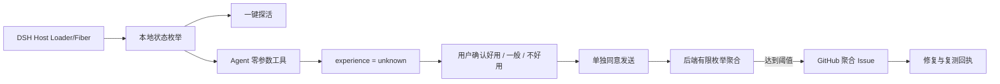

# Oh My DSH Plugin Lab

Plugin Lab 0.3 是 DeepSeek Harness rc.6 的零内容插件探活与体验反馈闭环。

它把两件事严格分开：

- DSH Host 可以判断插件当前是否正常运行；
- “好用 / 一般 / 不好用”只能由用户确认，Agent 不得读取会话或日志代替用户推断。

## 体验流程

1. `/omdsh-start <plugin>#<version>` 选择本次试用的公开插件。
2. 用户随时点击 Composer 左侧的“插件探活”，本地查看 `OK / 暂不可用 / 异常 / 未知`。
3. Agent 可以调用零参数工具 `omdsh_analyze_plugin_experience`，但只会得到运行状态和 `experience=unknown`。
4. 最新回复旁出现体验卡，由用户选择“好用 / 一般 / 不好用”。这一步只保存在本机。
5. 用户再次点击加入跟进或运行 `/omdsh-join latest`，才会发送屏幕上已经说明的有限字段。
6. 后端按插件、版本和状态聚合；达到阈值后创建 GitHub Issue，并通过回执邀请用户复测。



## 安装开发版本

```sh
pnpm install
pnpm pack:release
dsh plugin --profile web add ./oh-my-dsh-plugin-lab-0.3.0.tgz
dsh --profile web
```

Plugin Lab 是标准 DSH Bundle：`package.json` 通过 `dsh.bundle.patch` 声明 Host 插件，通过 `dsh.client` 提供 Web 探活、结果卡和收件箱。

版本 `0.3.0` 的 Peer 契约从 DSH `0.1.0-rc.6` 起。完整测试会执行真实的 rc.6 打包、安装、Host/Web 启动、Client Loader 注册和卸载。

## 命令与 Agent 工具

| 接口 | 作用 |
|---|---|
| `/omdsh-start <module>[#version]` | 开始单插件试用；不接受任务标签或备注 |
| `/omdsh-probe` | 本地读取当前目标的 Host 生命周期状态 |
| `/omdsh-result <good\|mixed\|bad>` | 用户确认体验，只保存本机 |
| `/omdsh-join <latest\|event-id>` | 单独同意发送有限字段 |
| `/omdsh-inbox [--peek]` | 查看聚合问题、修复版本与复测邀请 |
| `/omdsh-retest <receipt-id> <module>[#version]` | 从单条回执开始复测 |
| `/omdsh-status` | 查看本地试用、待发送和未读状态 |
| `/omdsh-privacy` | 显示完整隐私边界 |
| `omdsh_analyze_plugin_experience({})` | Agent 查询运行状态；输入必须为空 |

## 精确数据边界

唯一允许上传的数据包为：

```json
{
  "schemaVersion": 2,
  "type": "feedback.signal",
  "eventId": "随机单次 UUID",
  "plugin": {
    "moduleName": "marketplace-public-id",
    "version": "1.2.3"
  },
  "health": "ok",
  "experience": "good",
  "source": "user_confirmed"
}
```

复测时可以额外出现一个随机、单报告范围的 `retestOfReceiptId`。客户端和服务端都拒绝任何其他字段，而不是接收后脱敏。

不会创建、读取或发送：

- stdout、stderr、访问日志、应用日志；
- exception、错误码、stack、frame、崩溃指纹；
- Prompt、Assistant 回复、Agent memory、Tool 参数和结果；
- 文件、代码、路径、URL、环境变量、配置；
- 用户、账号、设备、安装、Session 等稳定标识；
- 客户端时间、locale、OS、架构、DSH/Node 版本、任务标签、计数和时延；
- 备注、理由或任何自由文本反馈。

本地 v2 文件只有：

```text
$DSH_HOME/omdsh-plugin-lab/
  feedback-v2.ndjson
  share-requests-v2.ndjson
  receipts-v2.ndjson
  receipt-seen-v2.ndjson
```

目录权限为 `0700`，文件权限为 `0600`。升级不会读取或补传旧版 `.install-id`、`events.ndjson` 或 `crashes.ndjson`；历史文件不会被自动删除。

网络传输天然会让服务器或中间层观察 IP、时间等元数据，因此项目只承诺“载荷零内容、无身份字段”，不宣称绝对匿名。生产部署必须关闭代理、网关、WAF、应用和数据库的请求体日志，并不得把 IP/User-Agent 写入业务数据。

更完整的可验证不变量和攻击测试见 [PRIVACY.md](./PRIVACY.md)。

## 启用中央反馈

Bundle 默认关闭网络发送：

```yaml
- id: omdsh-plugin-lab
  config:
    allowShare: true
    ingestUrl: https://feedback.example.com/v1/experience-events
    authorizationEnv: OMDSH_PLUGIN_LAB_TOKEN
    requestTimeoutMs: 5000
    retryIntervalMs: 30000
```

部署开启发送能力不等于用户同意。每条记录仍要由用户单独运行 `/omdsh-join`；拒绝发送不影响插件功能。

## 后端与 GitHub 飞轮

`server/` 提供 Node.js + PostgreSQL 接收器：

- 只接受 schema v2，未知字段 fail closed；
- 请求体上限 1 KiB，错误响应不回显输入或异常；
- 不存 IP、User-Agent、原始请求体或客户端时间；
- 不使用用户、安装或稳定匿名 ID，因此统计口径是“报告数”，不是“独立用户数”；
- 按公开插件、版本、health 和 experience 聚合；
- 默认同类报告达到 5 条后才创建 GitHub 聚合 Issue；
- GitHub 不接收单条反馈或回执 ID；
- Follow Token 只关联一条报告，用于返回修复与复测状态。

生产环境需要：

```text
DATABASE_URL
PUBLIC_BASE_URL
FOLLOW_SECRET
ADMIN_TOKEN
```

可选 GitHub 配置：

```text
GITHUB_TOKEN=<具有目标仓库 Issues 写权限的 token>
GITHUB_REPOSITORY=omdsh-dev/omdsh-plugin-lab
GITHUB_REPORT_THRESHOLD=5
```

## 验证

```sh
pnpm test:all
```

验证覆盖：闭合输入/输出 Schema、Loader 状态映射、Agent 零参数工具、内容非干涉金丝雀、无崩溃监听器、两阶段同意、Client 真实点击、后端未知字段拒绝、PostgreSQL v2 列审计、聚合阈值、回执/复测，以及真实 DSH rc.6 安装与启动生命周期。
