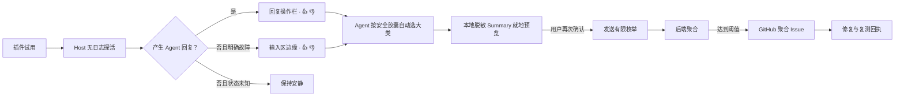

# Oh My DSH Plugin Lab

Plugin Lab 0.5 是面向 DeepSeek Harness rc.6 的隐私优先“体验回执”。它不做插件格子或常驻收集面板：一次插件试用确实产生 Agent 回复后，只在这条回复的操作栏显示 `插件名 · 👍 👎`；命令、纯 UI 或崩溃插件没有回复时，输入区边缘显示同样大小的兜底反馈条。

Agent 只接收一个安全胶囊：公开插件名、版本和 Host 状态枚举。客户端为摆放按钮只读取最新回复的消息 ID 与时间，不读取回复正文；任何一层都不扫描任务、文件或日志。

## 现在的体验

1. 从插件市场开始一次试用；在当前 rc.6 开发接入中也可用 `/omdsh-start <plugin>#<version>` 关联目标。
2. 客户端只查询 Host 的 `ok / unavailable / error / unknown` 有限状态；有 Agent 回复时，`👍 👎` 跟在该回复下面，没有回复且明确故障时才使用输入区兜底条。
3. 用户只点“好用 / 不好用”；Agent 按 Host 状态的固定规则自动选一个脱敏大类。兼容命令仍支持 `一般` 和手动大类。
4. 点击后在原位置就地展开完整“脱敏 Summary”，不弹模态框。Summary 只由公开插件坐标和有限枚举拼成；此时只保存到本地回执箱，没有网络请求。
5. 用户再次点击“确认发送”后，生成该 Summary 所需的有限枚举包才会发送；Session 历史只新增一条独立的“体验回执”卡片。
6. 回执箱显示本地待确认、等待发送和修复/复测进展。后端聚合到阈值后才创建 GitHub Issue。

普通 Agent/模型调用错误、网络错误或“缺少 API Key”不会触发这个入口，因为它们不能证明插件本身故障。Plugin Lab 不搜索对话或日志来猜测归因。

Agent 的“分析”不是自由阅读：工具输入必须为空，输出只有插件公开坐标、Host 状态、建议大类和允许的枚举。没有模型 API Key 时，固定规则建议与完整回执流程仍然可用。



Agent 可能已经拥有当前任务的正常会话上下文，但 Plugin Lab 工具不接受这些内容作为参数，也不读 Session 事件。客户端只用消息 ID 和时间把按钮挂到正确回复，不读取内容块。建议只由 Host 状态确定；主观体验由用户点击，并在 Summary 预览中再次确认。

## 安装开发版本

```sh
pnpm install
pnpm pack:release
dsh plugin --profile web add ./oh-my-dsh-plugin-lab-0.5.0.tgz
dsh --profile web
```

Plugin Lab 是标准 DSH Bundle：`package.json` 通过 `dsh.bundle.patch` 声明 Host 插件，通过 `dsh.client` 注册回复操作栏和无回复故障兜底条。探活、体验选择、脱敏预览和确认提交都保持在当前上下文里完成。

版本 `0.5.0` 的 Peer 契约从 DSH `0.1.0-rc.6` 起。完整测试会执行真实的 rc.6 打包、安装、Host/Web 启动、Client Loader 注册和卸载。

## 兼容命令与 Agent 工具

这些接口用于市场接入、自动化和排障；普通用户不需要逐个运行。命令默认只返回一到两行，完整数据边界集中在 `/omdsh-privacy`。

| 接口 | 作用 |
|---|---|
| `/omdsh-start <module>[#version]` | 开始单插件试用；不接受任务标签或备注 |
| `/omdsh-probe` | 本地读取当前目标的 Host 生命周期状态 |
| `/omdsh-result <verdict> <category>` | 用户确认体验和大类，生成本地预览 |
| `/omdsh-join <latest\|event-id>` | 用户确认发送已经展示的有限字段 |
| `/omdsh-inbox [--peek]` | 查看本地待确认回执、聚合进展与复测邀请 |
| `/omdsh-retest <receipt-id> <module>[#version]` | 从单条回执开始复测 |
| `/omdsh-status` | 查看本地试用、待发送和未读状态 |
| `/omdsh-privacy` | 显示完整隐私边界 |
| `omdsh_analyze_plugin_experience({})` | Agent 读取安全胶囊和建议大类；输入必须为空 |
| `omdsh_preview_plugin_feedback({experience, category})` | 生成无副作用固定模板预览；不保存、不上传 |

`verdict` 只能是 `good / mixed / bad`。`category` 只能是：

```text
installation | startup | invocation | compatibility
reliability | performance | result_quality | general
```

## 精确上传协议

唯一允许上传的数据包为：

```json
{
  "schemaVersion": 3,
  "type": "feedback.signal",
  "eventId": "随机单次 UUID",
  "plugin": {
    "moduleName": "marketplace-public-id",
    "version": "1.2.3"
  },
  "health": "error",
  "experience": "bad",
  "category": "reliability",
  "source": "user_confirmed"
}
```

复测时可以额外出现一个随机、单报告范围的 `retestOfReceiptId`。客户端和服务端拒绝任何其他字段。协议没有 `summary` 自由文本字段；界面和 GitHub 中看到的中文摘要都由上述枚举通过固定模板生成。

不会创建、读取或发送：

- 当前任务、任务标签、Prompt、Assistant 回复正文或 Agent memory；
- stdout、stderr、访问日志、应用日志或 Tool 参数/结果；
- exception、错误码、stack、frame、崩溃指纹；
- 文件、代码、路径、URL、环境变量、配置；
- 用户、账号、设备、安装、Session 等稳定标识；
- 客户端时间、locale、OS、架构、计数或时延；
- 备注、理由、模型自由摘要或其他自由文本。

本地 v3 文件只有：

```text
$DSH_HOME/omdsh-plugin-lab/
  feedback-v3.ndjson
  share-requests-v3.ndjson
  receipts-v3.ndjson
  receipt-seen-v3.ndjson
```

目录权限为 `0700`，文件权限为 `0600`。v3 不读取或补传旧版 `.install-id`、`events.ndjson`、`crashes.ndjson` 或 v2 队列；历史文件不会被自动删除。

网络传输仍会让服务器或中间层观察 IP、请求时间等元数据，因此项目不宣称绝对匿名。生产部署必须关闭代理、网关、WAF、应用和数据库的请求体日志，并不得把 IP/User-Agent 写入业务数据。

完整不变量和攻击测试见 [PRIVACY.md](./PRIVACY.md)。

## 启用中央反馈

Bundle 默认关闭网络发送：

```yaml
- id: omdsh-plugin-lab
  config:
    allowShare: true
    ingestUrl: https://feedback.example.com/v1/experience-events
    authorizationEnv: OMDSH_PLUGIN_LAB_TOKEN
    requestTimeoutMs: 5000
    retryIntervalMs: 30000
```

部署开启发送能力不等于用户同意。每条记录仍要由用户单独确认 `/omdsh-join`；拒绝发送不影响插件功能。

## 后端与 GitHub 飞轮

`server/` 提供 Node.js + PostgreSQL 接收器：

- 只接受 schema v3，未知字段 fail closed；
- 请求体上限 1 KiB，错误响应不回显输入或异常；
- 不存 IP、User-Agent、原始请求体或客户端时间；
- 不使用稳定用户 ID，统计口径是“报告数”而非“独立用户数”；
- 按公开插件、版本、health、experience 和 category 聚合；
- 默认同类报告达到 5 条后才创建 GitHub 聚合 Issue；
- GitHub 只接收固定模板和聚合计数，不接收单条反馈、回执 ID或任务信息；
- Follow Token 只关联一条报告，用于返回修复与复测状态。

生产环境需要：

```text
DATABASE_URL
PUBLIC_BASE_URL
FOLLOW_SECRET
ADMIN_TOKEN
```

可选 GitHub 配置：

```text
GITHUB_TOKEN=<具有目标仓库 Issues 写权限的 token>
GITHUB_REPOSITORY=omdsh-dev/omdsh-plugin-lab
GITHUB_REPORT_THRESHOLD=5
```

## 验证

```sh
pnpm test:all
```

验证覆盖闭合 Schema、Agent 探活/预览工具、任务内容 canary、两阶段确认、Client 真实点击、服务端未知字段拒绝、PostgreSQL v3 列审计、GitHub 固定模板、聚合阈值、回执/复测，以及真实 DSH rc.6 安装与启动生命周期。
